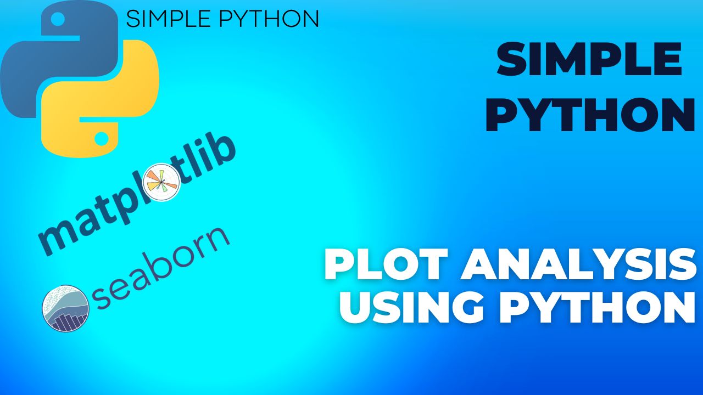
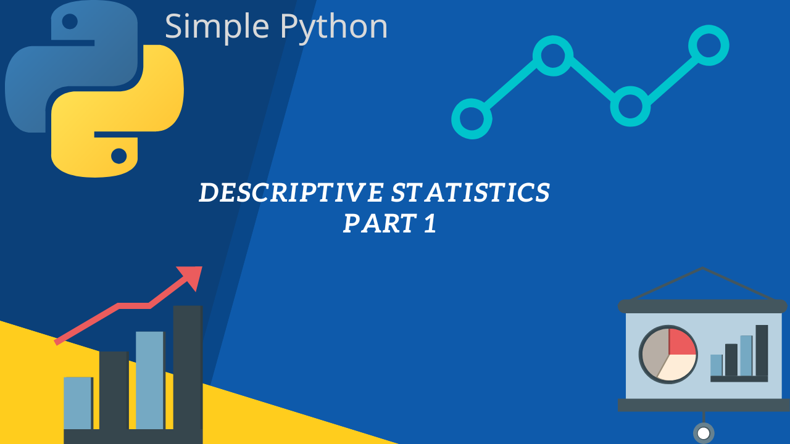
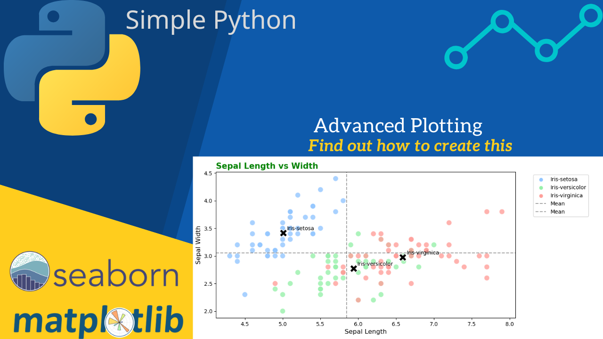

# JupyerNotebooks

## Pandas Introduction

This is a notebook to introduce the basics of Pandas. It is based on the [Pandas library](https://pandas.pydata.org/). Into this notebook, we will see how to import data from a CSV file, how to manipulate data, how to work with indexes and also we will see some extra functionality that this library has to offer.

Link to the notebook: [Pandas Introduction](pandas_intro.ipynb)

See the [Video](https://youtu.be/PL7pTL4XlrA) on my YouTube [channel](https://www.youtube.com/channel/UCFOOKhJITTAUBhE6FLqhQOw).

## Basic Plotting

This is a notebook to introduce the basics of plotting with Matplotlib and Seaborn libraries. Into this notebook, we will investigate different types of plots, how to customize them and how to deduce information from them.

Link to the notebook: [Basic Plotting](plotting.ipynb)

See the [Video](https://www.youtube.com/watch?v=wGkknq4zU-0) on my YouTube [channel](https://www.youtube.com/channel/UCFOOKhJITTAUBhE6FLqhQOw).

## Explore Statistics with Python - Collection

This is a collection of notebooks to introduce the basics of statistics with Python. Into this collection, we will see how to use statistics to explore data and how to use hypothesis testing to make decisions.

Also we will discover some other kinds of distributions so we can recognize them when we see them and to know how to work with them.

Link to the notebooks: [Explore Statistics with Python](Explore_Statistics)

See the [Video](https://youtu.be/e192i68H0NA) on my YouTube [channel](https://www.youtube.com/channel/UCFOOKhJITTAUBhE6FLqhQOw).

## Advanced Plotting

This is a notebook to introduce how to make your boring plots to look better and to pop out. We will learn how to add titles, labels and annotations to our plots. We will also learn how to make our plots look better by changing the style and the color palette.

Link to the notebooks: [Advanced Plotting](advanced_visuals.ipynb)

See the [Video]() on my YouTube [channel](https://www.youtube.com/channel/UCFOOKhJITTAUBhE6FLqhQOw).
